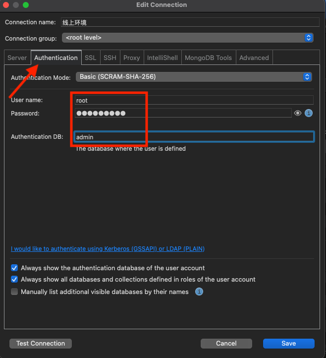

# 二.安装方式

::: tip 前言

- docker 方式：桌面端、命令方式
- 安装包：不同平台
- 命令方式

:::

## 1.安装包方式

mongodb32 位安装版 链接: https://pan.baidu.com/s/1SHJ1vre_CQOE3u-W0zniqQ 密码: chan

MongoDB64 位绿色版 链接: https://pan.baidu.com/s/1EkAB2SrcU1mfMfff_WDxtA 密码: w913

mongo 客户端 链接: https://pan.baidu.com/s/1YFxLZ-55D-WFR8os2fXN0A 密码: 61qd

## 2.命令方式

mac 安装

先安装 `homebrew`

使用 [brew](http://brew.sh/) 安装 mongodb

```sh
brew install mongodb
```

## 3.Docker 方式

## 4.可视化工具

[Robomongo](https://robomongo.org)

- 权限认证

  
